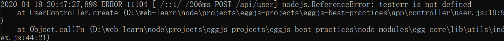

# eggjs 最佳实践

## 需求

- 用户管理
  - 创建用户-create
  - 删除单个用户-destroy
  - 修改用户-update
  - 获取单个用户-show
  - 获取所有用户(分页/模糊)-index
  - 删除所有用户-removes

- 用户鉴权
- 文件上传
- 适用各种客户端-RESTful

## 1. 初始化

```bash
# 创建项目
$ npm i egg-init -g
$ egg-init eggjs-best-practices --type=simple
$ cd eggjs-best-practices
# 启动项目
$ npm run dev
open localhost:7001
```

## 2. 添加swagger-doc

作用：在没有任何实现逻辑的情况下可视化并与API的资源交互。

​		它是根据您的OpenAPI（以前称为Swagger）规范自动生成的，它的可视化文档使后端实现和客户机端使用变得更加容易。

egg-swagger-doc-feat 参考：https://www.npmjs.com/package/egg-swagger-doc-feat/v/2.2.11

用户管理需要使用的路由如下：

| Method | Path           | Route Name | Controller.Action            |
| ------ | -------------- | ---------- | ---------------------------- |
| GET    | /user          | user       | app.controllers.user.index   |
| GET    | /user/new      | new_user   | app.controllers.user.new     |
| GET    | /user/:id      | user       | app.controllers.user.show    |
| GET    | /user/:id/edit | edit_user  | app.controllers.user.edit    |
| POST   | /user          | user       | app.controllers.user.create  |
| PUT    | /user/:id      | user       | app.controllers.user.update  |
| DELETE | /user/:id      | user       | app.controllers.user.destroy |

Controller ： 主要对用户的请求参数进行处理（校验、转换），然后调用对应的 service方法处理业务，得到业务结果后封装并返回：

1. 获取用户通过 HTTP 传递过来的请求参数。
2. 校验、组装参数。
3. 调用 Service 进行业务处理，必要时处理转换 Service 的返回结果，让它适应用户的需求。
4. 通过 HTTP 将结果响应给用户。

模板示例

```js
  async create() {
    const { ctx, service } = this
    // 校验参数
    ctx.validate(ctx.rule.createUserRequest)
    // 组装参数
    const payload = ctx.request.body || {}
    // 调用 Service 进行业务处理
    const res = await service.user.create(payload)
    // 设置响应内容和响应状态码
    ctx.helper.success({ctx, res})
  }

```

如果项目比较大，手动映射，维护起来比较麻烦，我们使用egg-swagger-doc-feat插件来实现**路由自动映射**。

### egg-swagger-doc-feat

- 作用

  应用于eggjs的plugin,可自动生成SwaggerUI。应用启动后访问/swaagger-ui.html可以浏览页面，访问/swagger-doc,获取swaggerjson.

- 安装

  `$ npm i egg-swagger-doc-feat --save`

- 使用

  ```js
  // {app_root}/config/plugin.js
  exports.swaggerdoc = {
    enable: true,
    package: 'egg-swagger-doc-feat',
  };
  ```

- 配置

  ```js
  // {app_root}/config/config.default.js
  exports.swaggerdoc = {
    dirScanner: './app/controller',
    apiInfo: {
      title: 'egg-swagger',
      description: 'swagger-ui for egg',
      version: '1.0.0',
    },
    schemes: ['http', 'https'],
    consumes: ['application/json'],
    produces: ['application/json'],
    securityDefinitions: {
      // apikey: {
      //   type: 'apiKey',
      //   name: 'clientkey',
      //   in: 'header',
      // },
      // oauth2: {
      //   type: 'oauth2',
      //   tokenUrl: 'http://petstore.swagger.io/oauth/dialog',
      //   flow: 'password',
      //   scopes: {
      //     'write:access_token': 'write access_token',
      //     'read:access_token': 'read access_token',
      //   },
      // },
    },
    enableSecurity: false,
    // enableValidate: true,
    routerMap: false,
    enable: true,
  };
  ```

### 实现

```js
--- a/config/plugin.js
+++ b/config/plugin.js
@@ -6,4 +6,8 @@ module.exports = {
   // static: {
   //   enable: true,
   // }
+  swaggerdoc: {
+    enable: true,
+    package: 'egg-swagger-doc-feat',
+  },
 };
--- a/config/config.default.js
+++ b/config/config.default.js
@@ -17,6 +17,21 @@ module.exports = appInfo => {

   // add your middleware config here
   config.middleware = [];
+  config.swaggerdoc = {
+    dirScanner: './app/controller',
+    apiInfo: {
+      title: 'eggjs-best-practices 项目接口',
+      description: 'swagger-ui for egg',
+      version: '1.0.0',
+    },
+    schemes: ['http', 'https'],// 发出文档使用的协议
+    consumes: ['application/json'],
+    produces: ['application/json'],
+    enableSecurity: false,
+    // enableValidate: true,
+    routerMap: true,// 自动生成API路由
+    enable: true,
+  };
```

​	完成插件引入之后，如果不修改默认配置，应用启动后，会自动扫描app/controller和**app/contract**下的文件。controller下的文件先不做描述。contract下的文件为定义好的请求体和响应体。

http://localhost:7001/swagger-ui.html
http://localhost:7001/swagger-doc

实验性功能：如果routerMap为true,允许自动生成API路由

#### 定义请求体和响应体

- 封装**基本**请求和响应，新建./app/contract/index.js

  ```js
  // 封装基本请求和响应
  module.exports = {
      baseRequest: {
          id: { type: 'string', description: 'id 唯一键', required: true, example: '1' }
      },
      baseResponse: {
          code: { type: 'integer', required: true, example: 0 },
          data: { type: 'string', example: '请求成功' },
          errorMessage: { type: 'string', example: '请求成功' },
      },
  };
  ```

- 创建**用户**需要使用的请求， 新建./app/contract/user.js

  ```js
  module.exports = {
      createUserRequest: {
          mobile: {
              type: 'string', required: true, description: '手机号', example: '18801731528', format: /^1[34578]\d{9}$/
          },
          password: { type: 'string', required: true, description: '密码', example: '123456', },
          realName: { type: 'string', required: true, description: '姓名', example: 'ocean' },
      },
  };
  ```

#### 在controller中使用egg-swagger-doc-feat

./app/controller/user.js

```js
const Controller = require('egg').Controller;
/**
* @Controller user
*/
class UserController extends Controller {
    constructor(ctx) {
        super(ctx);//调用父类的构造函数
    }
    /**
     * @Summary 创建用户
     * @Description 记录用户信息：用户名/密码/电话号
     * @Router post /api/user
     * @Request body createUserRequest *body
     * @Response 200 baseResponse 创建用户成功
     */
    async create() {
        const { ctx } = this;
        // 设置响应内容和响应状态码
        ctx.body = 'user ctrl'
    }
}
module.exports = UserController;
```

### 测试

1.在浏览器打开`http://localhost:7001/swagger-ui.html`


2.点击**Try it out**>Execute


使用postman

使用curl 发包

```
D:\web-learn\node\projects\eggjs-projects\eggjs-best-practices>curl -X POST "http://localhost:7001/api/user" -H "accept: application/json" -H "Content-Type: application/json" -d "{ \"mobile\": \"18801731528\", \"password\": \"123456\", \"realName\": \"ocean\"}"
user ctrl
```


## 2.统一异常处理

默认的异常处理， 详细的错误信息会直接抛出


中间件的定位是拦截用户请求，并在它前后做一些事情。

开发环境中， 我们需要详细的异常信息， 生产环境中， 我们不希望暴露应用的内部信息，我们需要自己实现一个统一错误处理的中间件来对错误进行处理。

./app./middleware./error_handler.js

得益于框架支持的异步编程模型，错误可以用 `try catch` 来捕获

```js
module.exports = () => {
    return async function errorHandler(ctx, next) {
        try {
            await next();
        } catch (err) {
            // 所有的异常都在 app 上触发一个 error 事件，框架会记录一条错误日志
            ctx.app.emit('error', err, ctx);

            const status = err.status || 500;
            // 生产环境时 500 错误的详细错误内容不返回给客户端，因为可能包含敏感信息
            const error = status === 500 && ctx.app.config.env === 'prod'
                ? 'Internal Server Error'
                : err.message;

            // 从 error 对象上读出各个属性，设置到响应中
            ctx.body = {
                code: status, // 服务端自身的处理逻辑错误(包含框架错误500 及 自定义业务逻辑错误533开始 ) 客户端请求参数导致的错误(4xx开始)，设置不同的状态码 
                error
            };
            if (status === 422) {
                ctx.body.detail = err.errors;
            }
            ctx.status = status;
        }
    };
};
```

./config/config.default.js

```js
--- a/config/config.default.js
+++ b/config/config.default.js
@@ -16,7 +16,7 @@ module.exports = appInfo => {
   config.keys = appInfo.name + '_1586555566673_8463';

   // add your middleware config here
-  config.middleware = [];
+  config.middleware = ['errorHandler'];
   config.swaggerdoc = {
     dirScanner: './app/controller',
     apiInfo: {

```

测试：经过处理后的异常如下





## 3. helper方法实现统一响应格式

Helper 函数用来提供一些实用的 utility 函数。

它的作用在于我们可以将一些常用的动作抽离在 helper.js 里面成为一个独立的函数，这样可以用 JavaScript 来写复杂的逻辑，避免逻辑分散各处。另外还有一个好处是 Helper 这样一个简单的函数，可以让我们更容易编写测试用例。

框架内置了一些常用的 Helper 函数。我们也可以编写自定义的 Helper 函数。

**./app/extend/helper.js**

```js
const moment = require('moment')
// 格式化时间
exports.formatTime = time => moment(time).format('YYYY-MM-DD HH:mm:ss')
// 处理成功响应
exports.success = ({ ctx, res = null, msg = '请求成功' }) => {
    ctx.body = {
        code: 0,
        data: res,
        msg
    }
    ctx.status = 200
}
```

./app/controller/user.js

```js
--- a/app/controller/user.js
+++ b/app/controller/user.js
@@ -16,7 +16,11 @@ class UserController extends Controller {
     async create() {
         const { ctx } = this;
         // 设置响应内容和响应状态码
-        ctx.body = 'user ctrl'
+        // testerr()
+        // ctx.body = 'user ctrl'
+        const res = {name: 'test'};
+        ctx.helper.success({ctx, res})
+
     }
 }

```

测试：执行代码


## 4.有效性检查

在保存数据之前，需要检查请求数据的有效性

### egg-validate

参考：

- https://github.com/eggjs/egg-validate#readme

- https://github.com/node-modules/parameter

作用：用于有效性检查

安装：`$ npm i egg-validate -s`

使用：

```js
// config/plugin.js
exports.validate = {
  enable: true,
  package: 'egg-validate',
};
```

示例1：验证请求正文

```js
// app/controller/home.js
const Controller = require('egg').Controller;
class HomeController extends Controller {
  async index() {
    const { ctx, app } = this;
    ctx.validate({ id: 'id' }); // will throw if invalid
    // or
    const errors = app.validator.validate({ id: 'id' }, ctx.request.body);
  }
}
module.exports = HomeController;
```

示例2：Extend Rules

```js
//app.js
app.validator.addRule('jsonString', (rule, value) => {
  try {
    JSON.parse(value);
  } catch (err) {
    return 'must be json string';
  }
});
```

### 实现

```js
--- a/app/controller/user.js
+++ b/app/controller/user.js
@@ -15,6 +15,11 @@ class UserController extends Controller {
      */
     async create() {
         const { ctx } = this;
+        // 校验 `ctx.request.body` 是否符合我们预期的格式
+        // 如果参数校验未通过，将会抛出一个 status = 422 的异常
+        // ctx.validate(createRule, ctx.request.body);
+        // ctx.validate(ctx.rule.createUserRequest, ctx.request.body);
+        ctx.validate(ctx.rule.createUserRequest);
         // 设置响应内容和响应状态码
         // testerr()
         // ctx.body = 'user ctrl'
diff --git a/config/plugin.js b/config/plugin.js
index b04f628..48b3a0b 100644
--- a/config/plugin.js
+++ b/config/plugin.js
@@ -10,4 +10,8 @@ module.exports = {
     enable: true,
     package: 'egg-swagger-doc-feat',
   },
+  validate: {
+    enable: true,
+    package: 'egg-validate',
+  },
 };

```

### 测试

修改ctx.request.body为：

```js
{
  "mobile": "19801731528",
  "password": "",
  "realName": "ocean"
}
```

参数校验未通过，抛出一个 status = 422 的异常


## 5.添加Model层

### egg-mongoose

```bash
$ npm install egg-mongoose -s
```

### 实现

- 使用egg-mongoose 插件

  ```js
  --- a/config/plugin.js
  +++ b/config/plugin.js
  @@ -14,4 +14,8 @@ module.exports = {
       enable: true,
       package: 'egg-validate',
     },
  +  mongoose: {
  +    enable: true,
  +    package: 'egg-mongoose',
  +  },
   };
  
  ```

- 连接数据库

  ```js
  --- a/config/config.default.js
  +++ b/config/config.default.js
  @@ -33,6 +33,16 @@ module.exports = appInfo => {
       enable: true,
     };
  
  +  config.mongoose = {
  +    client: {
  +      url: 'mongodb://127.0.0.1:27017/egg_server',
  +      options: {
  +        autoReconnect: true, // 自动连接
  +        reconnectTries: Number.MAX_VALUE,
  +        bufferMaxEntries: 0,
  +      },
  +    },
  +  };
     // add your user config here
     const userConfig = {
       // myAppName: 'egg',
  ```

#### 添加user model

 ./app/model/user.js

```js
module.exports = app => {
    const mongoose = app.mongoose;
    const Schema = mongoose.Schema;
	
    const UserSchema = new Schema({
        mobile: { type: String, unique: true, required: true },
        password: { type: String, required: true },
        realName: { type: String, required: true },
        avatar: { type: String, default: 'https://1.gravatar.com/avatar/a3e54af3cb6e157e496ae430aed4f4a3?s=96&d=mm' },
        extra: { type: mongoose.Schema.Types.Mixed },
        createdAt: { type: Date, default: Date.now }
    });

    return mongoose.model('User', UserSchema);
}
```

#### 密码加密-egg-bcrypt

安装：`$ npm install egg-bcrypt -s`

./config/plugin.js

```js
bcrypt : {
    enable: true,
    package: 'egg-bcrypt'
}
```

#### 保存到数据库

新建./app/service/user.js

在创建用户时， 把用户的密码加密后保存到数据库

```js
const Service = require('egg').Service;
class UserService extends Service {
    /**
     * 创建用户
     * @param {*} payload 
     */
    async create(payload) {
        // 密码加密
        payload.password = await this.ctx.genHash(payload.password);//给密码加密
        return this.ctx.model.User.create(payload);
    }
}
module.exports = UserService;
```

更新./app/controller/user.js如下：

```js
const Controller = require('egg').Controller;
/**
* @Controller user
*/
class UserController extends Controller {
    constructor(ctx) {
        super(ctx);//调用父类的构造函数
    }
    /**
     * @Summary 创建用户
     * @Description 记录用户信息：用户名/密码/电话号
     * @Router post /api/user
     * @Request body createUserRequest *body
     * @Response 200 baseResponse 创建用户成功
     */
    async create() {
        const { ctx, service } = this;
        // 校验 `ctx.request.body` 是否符合我们预期的格式
        // 如果参数校验未通过，将会抛出一个 status = 422 的异常
        // ctx.validate(createRule, ctx.request.body);
        // ctx.validate(ctx.rule.createUserRequest, ctx.request.body);
        ctx.validate(ctx.rule.createUserRequest);
        // 组装参数
        const payload = ctx.request.body || {}
        // 调用 Service 进行业务处理
        const res = await service.user.create(payload)
        // 设置响应内容和响应状态码
        ctx.helper.success({ ctx, res })

    }
}
module.exports = UserController;
```

### 测试

ctx.request.body

```js
{
  "mobile": "18801731528",
  "password": "123456",
  "realName": "ocean"
}
```


 用户信息存储到数据库


### 实现用户的增删改查

| Method | Path           | Route Name | Controller.Action            |              |
| ------ | -------------- | ---------- | ---------------------------- | ------------ |
| POST   | /api/user      | user       | app.controllers.user.create  | 创建用户     |
| GET    | /api/user      | user       | app.controllers.user.index   | 获取所有用户 |
| GET    | /api/user/{id} | user       | app.controllers.user.show    | 获取单个用户 |
| PUT    | /api/user/     | user       | app.controllers.posts.update | 修改用户     |
| DELETE | /api/user/{id} | user       | app.controllers.user.destroy | 删除单个用户 |
|        |                |            |                              |              |
|        |                |            |                              |              |

更新./app/controller/user.js如下：

```js
const Controller = require('egg').Controller;
/**
* @Controller user
*/
class UserController extends Controller {
    constructor(ctx) {
        super(ctx);//调用父类的构造函数
    }
    /**
     * @Summary 创建用户
     * @Description 记录用户信息：用户名/密码/电话号
     * @Router post /api/user
     * @Request body createUserRequest *body
     * @Response 200 baseResponse 创建用户成功
     */
    async create() {
        const { ctx, service } = this;
        // 校验 `ctx.request.body` 是否符合我们预期的格式
        // 如果参数校验未通过，将会抛出一个 status = 422 的异常
        // ctx.validate(createRule, ctx.request.body);
        // ctx.validate(ctx.rule.createUserRequest, ctx.request.body);
        ctx.validate(ctx.rule.createUserRequest);
        // 组装参数
        const payload = ctx.request.body || {}
        // 调用 Service 进行业务处理
        const res = await service.user.create(payload)
        // 设置响应内容和响应状态码
        ctx.helper.success({ ctx, res })
    }


    /**
     * @summary 删除单个用户
     * @description 删除单个用户
     * @router delete /api/user/{id}
     * @request path string *id eg:1 用户ID
     * @response 200 baseResponse 创建成功
     */
    async destroy() {
        const { ctx, service } = this
        // 校验参数
        const { id } = ctx.params
        // 调用 Service 进行业务处理
        await service.user.destroy(id)
        // 设置响应内容和响应状态码
        ctx.helper.success({ ctx })
    }

    /**
     * @summary 修改用户
     * @description 获取用户信息
     * @router put /api/user/
     * @response 200 baseResponse 创建成功
     * @ignore
     */
    async update() {
        const { ctx, service } = this
        // 校验参数
        ctx.validate(ctx.rule.createUserRequest)
        // 组装参数
        const { id } = ctx.params
        const payload = ctx.request.body || {}
        // 调用 Service 进行业务处理
        await service.user.update(id, payload)
        // 设置响应内容和响应状态码
        ctx.helper.success({ ctx })
    }

    /**
     * @summary 获取单个用户
     * @description 获取用户信息
     * @router get /api/user/{id}
     * @request url baseRequest
     * @response 200 baseResponse 创建成功
     */
    async show() {
        const { ctx, service } = this
        // 组装参数
        const { id } = ctx.params
        // 调用 Service 进行业务处理
        const res = await service.user.show(id)
        // 设置响应内容和响应状态码
        ctx.helper.success({ ctx, res })
    }


    /**
     * @summary 获取所有用户(分页/模糊)
     * @description 获取用户信息
     * @router get /api/user
     * @request query integer *currentPage eg:1 当前页
     * @request query integer *pageSize eg:10 单页数量
     * @request query string search eg: 搜索字符串
     * @request query boolean isPaging eg:true 是否需要翻页
     * @response 200 baseResponse 创建成功
     */
    async index() {
        const { ctx, service } = this
        // 组装参数
        const payload = ctx.query
        // 调用 Service 进行业务处理
        const res = await service.user.index(payload)
        // 设置响应内容和响应状态码
        ctx.helper.success({ ctx, res })
    }

    /**
     * @summary 删除所选用户
     * @description 删除所选用户
     * @router delete /api/user/{id}
     * @request path string *id
     * @response 200 baseResponse 创建成功
     */
    async removes() {
        const { ctx, service } = this
        // 组装参数
        // const payload = ctx.queries.id
        const { id } = ctx.request.body
        const payload = id.split(',') || []
        // 调用 Service 进行业务处理
        const result = await service.user.removes(payload)
        // 设置响应内容和响应状态码
        ctx.helper.success({ ctx })
    }
}
module.exports = UserController;
```


## 6.启动自定义

参考：https://eggjs.org/zh-cn/basics/app-start.html

### 通过生命周期初始化数据

在启动应用时，应该初始化数据库

./app.js

```js
// app.js
class AppBootHook {
    constructor(app) {
        this.app = app;
    }

    configWillLoad() {
        // 此时 config 文件已经被读取并合并，但是还并未生效
        // 这是应用层修改配置的最后时机
        // 注意：此函数只支持同步调用

        // 例如：参数中的密码是加密的，在此处进行解密
        // this.app.config.mysql.password = decrypt(this.app.config.mysql.password);
        // 例如：插入一个中间件到框架的 coreMiddleware 之间
        // const statusIdx = this.app.config.coreMiddleware.indexOf('status');
        // this.app.config.coreMiddleware.splice(statusIdx + 1, 0, 'limit');
    }

    async didLoad() {
        // 所有的配置已经加载完毕
        // 可以用来加载应用自定义的文件，启动自定义的服务

        // 例如：创建自定义应用的示例
        // this.app.queue = new Queue(this.app.config.queue);
        // await this.app.queue.init();

        // 例如：加载自定义的目录
        // this.app.loader.loadToContext(path.join(__dirname, 'app/tasks'), 'tasks', {
        //     fieldClass: 'tasksClasses',
        // });
    }

    async willReady() {
        // 所有的插件都已启动完毕，但是应用整体还未 ready
        // 可以做一些数据初始化等操作，这些操作成功才会启动应用

        // 例如：从数据库加载数据到内存缓存
        // this.app.cacheData = await this.app.model.query(QUERY_CACHE_SQL);
    }

    async didReady() {
        // 应用已经启动完毕
        const ctx = await this.app.createAnonymousContext();
        await ctx.model.User.remove();
        await ctx.service.user.create({
            mobile: '18250860627',
            password: '123456',
            realName: 'yang',
        })
    }

    async serverDidReady() {
        // http / https server 已启动，开始接受外部请求
        // 此时可以从 app.server 拿到 server 的实例

        // this.app.server.on('timeout', socket => {
        //     // handle socket timeout
        // });
    }
}

module.exports = AppBootHook;
```

启动程序后，数据库中已经存在数据初始数据

## 7.用户鉴权

没有成功登录应用， 就不能向数据库写数据

### egg-jwt

作用:Egg's JWT(JSON Web Token Authentication Plugin)

安装：`$ npm i egg-jwt --save`

使用：

```js
// {app_root}/config/plugin.js
exports.jwt = {
  enable: true,
  package: "egg-jwt"
};
```

配置：

```
// {app_root}/config/config.default.js
exports.jwt = {
  secret: "123456"
};
```

使用示例：

```js
// app/router.js
"use strict";
 
module.exports = app => {
  app.get("/", app.jwt, "render.index"); // use old api app.jwt
  app.get("/login", "login.index");
  app.get("/success", "success.index"); // is setting in config.jwt.match
};
 
// app/controller/render.js
("use strict");
 
module.exports = app => {
  class RenderController extends app.Controller {
    *index() {
      this.ctx.body = "hello World";
    }
  }
  return RenderController;
};
 
// app/controller/login.js
("use strict");
 
module.exports = app => {
  class LoginController extends app.Controller {
    *index() {
      this.ctx.body = "hello admin";
    }
  }
  return LoginController;
};
 
// app/controller/success.js
("use strict");
 
module.exports = app => {
  class SuccessController extends app.Controller {
    *index() {
      this.ctx.body = this.ctx.state.user;
    }
  }
  return SuccessController;
};
```


### 实现

```js
--- a/config/config.default.js
+++ b/config/config.default.js
@@ -43,6 +43,11 @@ module.exports = appInfo => {
       },
     },
   };
+  config.jwt = {
+    secret: 'Great4-M',
+    enable: true, // default is false
+    match: /^\/api/, // optional 有/api前缀
+  };
   // add your user config here
   const userConfig = {
     // myAppName: 'egg',
diff --git a/config/plugin.js b/config/plugin.js
index 32355f0..aeed00c 100644
--- a/config/plugin.js
+++ b/config/plugin.js
@@ -22,4 +22,8 @@ module.exports = {
     enable: true,
     package: 'egg-bcrypt',
   },
+  jwt: {
+    enable: true,
+    package: "egg-jwt"
+  },
 };
```

如果请求url有/api 前缀就用jwt进行鉴权


### 实现用户登录登出

- 定义swagger-doc用户登录登出请求体- 新建./app/contract/userAccess.js

  ```js
  module.exports = {
      loginRequest: {
          mobile: {
              type: 'string', required: true, description: '手机号', example: '18801731528',
              format: /^1[34578]\d{9}$/
          },
          password: { type: 'string', required: true, description: '密码', example: '123456', },
      },
  };
  ```

- 实现用户登录登出逻辑-新建./app/controller/userAccess.js

  ```js
  const Controller = require('egg').Controller;
  /**
  * @Controller 用户鉴权
  */
  class UserAccessController extends Controller {
      constructor(ctx) {
          super(ctx);//调用父类的构造函数
      }
      /**
       * @Summary 用户登入
       * @Description 用户登入
       * @Router post /auth/jwt/login
       * @Request body loginRequest *body
       * @Response 200 baseResponse 登录成功
       */
      async login() {
          const { ctx, service } = this;
          // 校验参数
          ctx.validate(ctx.rule.loginRequest);
          // 组装参数
          const payload = ctx.request.body || {}
          // 调用 Service 进行业务处理
          const res = await service.userAccess.login(payload)
          // 设置响应内容和响应状态码
          ctx.helper.success({ ctx, res })
      }
  
      /**
       * @Summary 用户登出
       * @Description 用户登出
       * @Router post /auth/jwt/logout
       * @Request body loginRequest *body
       * @Response 200 baseResponse 登出成功
       */
      async logout() {
          const { ctx, service } = this;
          // 调用 Service 进行业务处理
          await service.userAccess.logout()
          // 设置响应内容和响应状态码
          ctx.helper.success({ ctx })
      }
  }
  module.exports = UserAccessController;
  ```

- 创建用户鉴权需要使用的Token-新建./app/service/actionToken.js

  ```js
  'use strict'
  const Service = require('egg').Service
  class ActionTokenService extends Service {
      async apply(_id) {
          const { ctx } = this
          return ctx.app.jwt.sign({
              data: {
                  _id: _id
              },
              exp: Math.floor(Date.now() / 1000) + (60 * 60 * 24 * 7)
          }, ctx.app.config.jwt.secret)
      }
  }
  module.exports = ActionTokenService
  ```

- 抽象用户登录登出业务逻辑--新建./app/service/userAccess.js

  ```js
  'use strict'
  const Service = require('egg').Service
  class UserAccessService extends Service {
  
      async login(payload) {
          const { ctx, service } = this
          //把用户从数据库中取出
          const user = await service.user.findByMobile(payload.mobile)
  
          if (!user) { // 数据库中没有这个用户
              ctx.throw(404, 'user not found')
          }
          //比较密码
          let verifyPsw = await ctx.compare(payload.password, user.password)
  
          if (!verifyPsw) {
              ctx.throw(404, 'user password is error')
          }
          // 生成Token
          return { token: await service.actionToken.apply(user._id) }
      }
  
      async logout() {
  
      }
  
      async current() {
          const { ctx, service } = this
          // ctx.state.user 可以提取到JWT编码的data
          const _id = ctx.state.user.data._id
  
          const user = await service.user.find(_id) // 根据_id查找到用户
          if (!user) {
              ctx.throw(404, 'user is not found')
          }
          user.password = 'How old are you?'
          return user
      }
  }
  module.exports = UserAccessService
  ```

  

### 测试

./app/public/index.html

```html
<html>

<head>
    <meta charset="UTF-8">
    <meta name="viewport" content="width=device-width,initial-scale=1,user-scalable=0">
    <script src="https://cdn.jsdelivr.net/npm/vue/dist/vue.js"></script>
    <script src="https://unpkg.com/element-ui/lib/index.js"></script>
    <script src="https://unpkg.com/axios/dist/axios.min.js"></script>
    <link rel="stylesheet" href="https://unpkg.com/element-ui/lib/theme-chalk/index.css" />
    <script src="https://cdn.bootcss.com/qs/6.6.0/qs.js"></script>
    <link rel="stylesheet" href="https://unpkg.com/element-ui/lib/theme-chalk/index.css" />
    <style>
        .cube-btn {
            margin: 10px 0;
        }
    </style>
</head>

<body>
    <div id="app">
        <!-- <div><a href="/swagger-ui.html">SwaggerUI</a></div> -->
        <!-- <div><a href="https://www.easy-mock.com/project/5ce3669a733e8967c7b2e902">EasyMock地址</a></div> -->
        <div>
            <el-button @click="create">Create User</el-button>
            <el-button @click="list">User List</el-button>
            <el-button @click="del">Delete User</el-button>
        </div>
        <div>
            <el-button @click="login">Login</el-button>
            <el-button @click="logout">Logout</el-button>
            <el-button @click="getUserList">Get User List</el-button>
        </div>
        <div>
            <el-button onclick="document.getElementById('log').innerHTML = ''">Clear Log</el-button>
        </div>
        <h6 id="log"></h6>
    </div>
    <script>
        // axios.defaults.baseURL = 'http://localhost:3000'
        axios.defaults.withCredentials = true
        axios.interceptors.request.use(
            config => {
                const token = window.localStorage.getItem("token");
                if (token) {
                    // 判断是否存在token，如果存在的话，则每个http header都加上token
                    // Bearer是JWT的认证头部信息
                    config.headers.common["Authorization"] = "Bearer " + token;
                }
                return config;
            },
            err => {
                return Promise.reject(err);
            }
        )
        axios.interceptors.response.use(
            response => {
                document.getElementById('log').append(JSON.stringify(response.data))
                return response;
            }
        );
        var app = new Vue({
            el: '#app',
            data: {
                value: 'input',
                token: {}
            },
            methods: {
                async create() {
                    await axios.post('/api/user', {
                        mobile: '18250860627',
                        password: '666666',
                        realName: 'ocean',
                    })
                },
                async list() {
                    const res = await axios.get('/api/user')
                    this.list = res.data.data.list
                },
                async del() {
                    console.log('list', this.list)
                    this.list.map(v => {
                        axios.delete(`/api/user/${v._id}`)
                    })
                },
                async login() {
                    const res = await axios.post('/auth/jwt/login', {
                        mobile: '18250860627',
                        password: '123456'
                    })
                    //设置返回的token
                    localStorage.setItem("token", res.data.data.token);
                },
                async logout() {
                    const res = await axios.post('/auth/jwt/logout')
                    localStorage.removeItem("token");
                },
                async getUserList() {
                    await axios.get('/api/user')
                }
            },
            mounted: function () {},
        });
    </script>
</body>

</html>
```

在浏览器打开`http://localhost:7001/public/index.html`

1.用户登录

​	1）服务器端根据客户端传入的用户信息去数据库中查找用户，

​			如果没有找到，登录失败

​			如果找到用户，检查密码是否正确， 密码正确，生成token并返回

​	2）前端接收到返回的数据， 把token保存到localStorage中

2.在客户端 创建用户， 删除用户等操作， 向服务器端发送的请求头**Authorization**	字段会携带token，

​		服务器端收到请求后， 发现**Request URL** 匹配/api 	会进行用户鉴权， 如果token 匹配， 就继续进行操作， 不匹配返回401.

3.用户登出

​	从localStorage 中删除token.

## 8.文件上传

### await-stream-ready

- 作用

  A promise waiting stream ready

- 安装

  ```bash
  $ npm i await-stream-ready --save
  ```

- 使用

  - 等待读取流

    ```js
    const fs = require('fs');
    const awaitReadStream = require('await-stream-ready').read;
    
    async function read(file) {
      const stream = fs.createReadStream(file);
      stream.on('data', buf => {
        // consume buf
      });
      await awaitReadStream(stream);
    }
    ```

  - 等待写入流

    ```js
    const fs = require('fs');
    const awaitWriteStream = require('await-stream-ready').write;
    
    async function write(srcStream, file) {
      const stream = srcStream.pipe(fs.createWriteStream(file));
      await awaitWriteStream(stream);
    }
    ```

- 参考

  https://github.com/node-modules/await-stream-ready

### stream-wormhole

- 作用

  Pipe ReadStream to a wormhole.

- 安装

  ```bash
  $ npm i stream-wormhole --save
  ```

- 使用

  ```js
  const sendToWormhole = require('stream-wormhole');
  const fs = require('fs');
  
  const readStream = fs.createReadStream(__filename);
  
  // ignore all error by default
  sendToWormhole(readStream, true)
    .then(() => console.log('done'));
  
  // throw error
  sendToWormhole(readStream, true)
    .then(() => console.log('done'))
    .catch(err => console.error(err));
  ```

- 参考

  https://github.com/node-modules/stream-wormhole

### image-downloader

- 作用

  A Node module for downloading image to disk from a given URL

  用于从给定的URL将图像下载到磁盘

- 安装

  ```bash
  $ npm i image-downloader --save
  ```

- 语法

  ```js
  declare module download {
    image(options: Options): Promise<{ filename: string }>;
  }
  ```

- 选项

  - **url** (必填) - 要下载的图像URL

  - **dest** (必填) - 图像目标。可以是目录或文件名。如果给定了一个目录，ID将自动从中提取图像文件名`选项.url`

  - **extractFilename** - 指示是否自动从`options.url`中提取图像文件名。

    设置为“false”以具有`options.dest`没有文件扩展名。（默认值：`true`）

  - **headers** - HTTP头（默认：`{}`）

  - **timeout** - 请求超时前的毫秒数

- 使用

  - 下载到一个目录并用原始文件名保存

    ```js
    const download = require('image-downloader')
     
    const options = {
      url: 'http://someurl.com/image.jpg',
      dest: '/path/to/dest'                // will be saved to /path/to/dest/image.jpg
    }
     
    download.image(options)
      .then(({ filename }) => {
        console.log('Saved to', filename)  // saved to /path/to/dest/image.jpg
      })
      .catch((err) => console.error(err))
    
    ```

  - 下载到一个目录并用另一个文件名保存

    ```js
    const download = require('image-downloader')
     
    options = {
      url: 'http://someurl.com/image2.jpg',
      dest: '/path/to/dest/photo.jpg'      // will be saved to /path/to/dest/photo.jpg
    }
     
    download.image(options)
      .then(({ filename }) => {
        console.log('Saved to', filename)  // saved to /path/to/dest/photo.jpg
      })
      .catch((err) => console.error(err))
    ```

  - 使用另一个不带扩展名的文件名下载

    ```js
    const download = require('image-downloader')
     
    options = {
      url: 'http://someurl.com/image3.jpg',
      dest: '/path/to/dest/photo',         // will be saved to /path/to/dest/photo
      extractFilename: false
    }
     
    download.image(options)
      .then(({ filename }) => {
        console.log('Saved to', filename)  // saved to /path/to/dest/photo
      })
      .catch((err) => console.error(err))
    ```

- 参考

  [gitlab.com/demsking/image-downloader](https://gitlab.com/demsking/image-downloader)

### 实现

1. 安装上述插件

   ```bash
   $ npm i await-stream-ready stream-wormhole image-downloader -s
   ```

2. 添加上传业务逻辑-新建./app/controller/upload.js

   ```js
   const fs = require('fs')
   const path = require('path')
   const awaitWriteStream = require('await-stream-ready').write
   const sendToWormhole = require('stream-wormhole')
   const download = require('image-downloader')
   const Controller = require('egg').Controller
   
   /**
    * @Controller 文件上传
    */
   class UplaodController extends Controller {
       constructor(ctx) {
           super(ctx)
       }
   
       /**
        * @summary 上传单个文件
        * @description 上传单个文件
        * @router post /api/upload/single
        */
       async create() {
           const { ctx } = this;
           // 校验参数
           
   
           // 要通过 ctx.getFileStream 便捷的获取到用户上传的文件，需要满足两个条件：
           // 只支持上传一个文件。
           // 上传文件必须在所有其他的 fields 后面，否则在拿到文件流时可能还获取不到 fields。
           // 获取上传文件
           const stream = await ctx.getFileStream()
           // 所有表单字段都能通过 `stream.fields` 获取到
           // const filename = path.basename(stream.filename) // 文件名称
           const extname = path.extname(stream.filename).toLowerCase() // 文件扩展名称
           const uuid = (Math.random() * 999999).toFixed()
           //组装参数
           const target = path.join(this.config.baseDir, 'app/public/uploads',
               `${uuid}${extname}`)
           const writeStream = fs.createWriteStream(target)
           // 文件处理，上传到云存储等等
           try {
               await awaitWriteStream(stream.pipe(writeStream))
           } catch (err) {
               // 必须将上传的文件流消费掉，要不然浏览器响应会卡死
               await sendToWormhole(stream)
               throw err
           }
           // 调用 Service 进行业务处理
           // 设置响应内容和响应状态码
           ctx.helper.success({ ctx })
       }
   }
   module.exports = UplaodController
   ```

- 添加上传页面-新建./app/public/index.html

  ```html
  <!DOCTYPE html>
  <html lang="en">
  
  <head>
      <meta charset="UTF-8">
      <meta name="viewport" content="width=device-width, initial-scale=1.0">
      <meta http-equiv="X-UA-Compatible" content="ie=edge">
      <title>上传文件</title>
      <link rel="stylesheet" href="https://unpkg.com/element-ui/lib/theme-chalk/index.css">
      <style>
          .avatar-uploader .el-upload {
              border: 1px dashed #d9d9d9;
              border-radius: 6px;
              cursor: pointer;
              position: relative;
              overflow: hidden;
              width: 178px;
              height: 178px;
          }
  
          .avatar-uploader .el-upload:hover {
              border-color: #409EFF;
          }
  
          .avatar-uploader-icon {
              font-size: 28px;
              color: #8c939d;
              width: 178px;
              height: 178px;
              line-height: 178px;
              text-align: center;
          }
  
          .avatar {
              width: 178px;
              height: 178px;
              display: block;
          }
  
          .image-preview {
              width: 178px;
              height: 178px;
              position: relative;
              border: 1px dashed #d9d9d9;
              border-radius: 6px;
              float: left;
          }
  
          .image-preview .image-preview-wrapper {
              position: relative;
              width: 100%;
              height: 100%;
          }
  
          .image-preview .image-preview-wrapper img {
              width: 100%;
              height: 100%;
          }
  
          .image-preview .image-preview-action {
              position: absolute;
              width: 100%;
              height: 100%;
              left: 0;
              top: 0;
              cursor: default;
              text-align: center;
              color: #fff;
              opacity: 0;
              font-size: 20px;
              background-color: rgba(0, 0, 0, .5);
              transition: opacity .3s;
              cursor: pointer;
              text-align: center;
              line-height: 200px;
          }
  
          .image-preview .image-preview-action .el-icon-delete {
              font-size: 32px;
          }
  
          .image-preview:hover .image-preview-action {
              opacity: 1;
          }
      </style>
  </head>
  
  <body>
      <div id="app">
  
          <el-upload v-show="imageUrl.length < 1" class="avatar-uploader" :action="serverUrl" :show-file-list="false"
              multiple :before-upload="beforeUpload" :headers="token" :on-success="handleSuccess"
              :on-progress="uploadProcess">
              <i v-show="imageUrl =='' && imgFlag == false" class="el-icon-plus avatar-uploader-icon"></i>
              <el-progress v-show="imgFlag == true" type="circle" :percentage="percent" style="margin-top: 20px">
              </el-progress>
          </el-upload>
  
          <div class="image-preview" v-show="imageUrl.length > 1">
              <div class="image-preview-wrapper">
                  
                  <div class="image-preview-action">
                      <i @click="handleRemove" class="el-icon-delete"></i>
                  </div>
              </div>
          </div>
  
      </div>
  </body>
  <script src="https://unpkg.com/vue/dist/vue.js"></script>
  <script src="https://unpkg.com/element-ui/lib/index.js"></script>
  <script>
      new Vue({
          el: '#app',
          data() {
              return {
                  serverUrl: "/api/upload/single", // 后台上传接口
                  token: {},
                  imgFlag: false,
                  percent: 0,
                  imageUrl: '',
              };
          },
          mounted() {},
          methods: {
              handleRemove(file, fileList) {
                  this.imageUrl = '';
              },
              beforeUpload(file) {// 在上传文件到服务器端之前，检查文件 并设置token
                  const isLt10M = file.size / 1024 / 1024 < 10;
                  if (
                      ['image/jpeg',
                          'image/gif',
                          'image/png',
                          'image/bmp'
                      ].indexOf(file.type) == -1) {
                      this.$message.error('请上传正确的图片格式');
                      return false;
                  }
                  if (!isLt10M) {
                      this.$message.error('上传图片不能超过10MB哦!');
                      return false;
                  }
                  // 设置认证信息
                  const token = window.localStorage.getItem("token")
                  this.token["Authorization"] = "Bearer " + token
              },
              handleSuccess(res, file) {
                  this.imgFlag = false;
                  this.percent = 0;
                  if (res) {
                      this.imageUrl = URL.createObjectURL(file.raw); // 项目中用后台返回的真实地址
                  } else {
                      this.$message.error('视频上传失败，请重新上传！');
                  }
              },
              uploadProcess(event, file, fileList) { // 文件上传进度条
                  this.imgFlag = true;
                  console.log(event.percent);
                  this.percent = Math.floor(event.percent);
              },
          }
      })
  </script>
  
  </html>
  ```

### 测试

在浏览器打开http://localhost:7001/public/upload.html

1.在上传图片到服务器端之前， 检测上传图片的合法性， 如果图片合法， 设置上传的请求头的 Authorization 字段

2.上传请求发送到服务器端， 服务器端会对上传请求进行jwt鉴权,  

​	用户身份合法， 继续上传操作

​	用户身份不合法， 提示上传失败

详细上传参考：

https://github.com/ocean010101/yblog

https://github.com/ocean010101/yblog-ui

